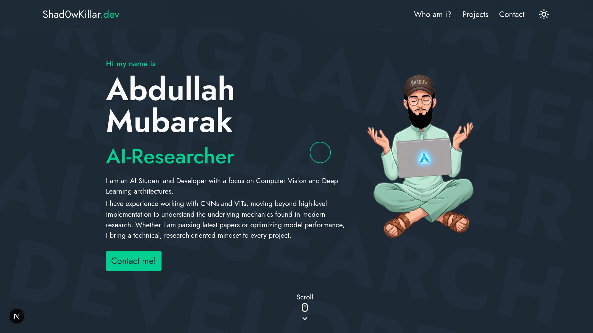

# shad0w-dev

A highly optimized, modern developer portfolio engineered to showcase advanced software development projects and system architectures. This platform serves as a digital resume.

---

## Overview

The shad0w-dev platform is built with performance, accessibility, and modern web standards in mind. It features a fully responsive architecture, a dynamic content delivery mechanism for articles, and fluid interactive components. Designed specifically for developers who demand clean design alongside deep technical expressiveness, the repository provides a scalable foundation for personal branding and documentation.

---

## Key Features

* **Dynamic MDX Blog Engine**: Author technical write-ups using Markdown enhanced with live React components, syntax highlighting, and custom embed scripts.
* **Responsive Fluid Layouts**: Fluid layout design adapted for seamless viewing across high-resolution desktop monitors, tablets, and mobile devices.
* **Optimized Asset Pipeline**: Automated image optimization, lazy loading, and code-splitting routines to ensure minimal Time to Interactive (TTI).
* **Robust Core Architecture**: Modular component structure facilitating trivial updates, high maintainability, and clean separation of concerns.
* **SEO Optimized**: Pre-configured metadata, Open Graph tags, and structured data schemas to ensure optimal indexing and visibility across platforms.

---

## Tech Stack

| Layer | Technology | Purpose |
| :--- | :--- | :--- |
| **Framework** | React / Next.js | Server-side rendering, routing, and static site generation |
| **Styling** | Tailwind CSS / PostCSS | Utility-first responsive design and custom themes |
| **Content** | MDX | Markdown parsing with embedded interactive components |
| **Icons** | Lucide React | Scalable vector icon library |
| **Deployment** | Vercel / Netlify | Continuous integration and global edge delivery |

---

## Getting Started

Follow these instructions to set up the development environment and run the project locally on your machine.

### Prerequisites

Ensure you have the following software installed on your local environment:

* Node.js (Version 18.x or higher recommended)
* npm, yarn, or pnpm package manager

### Installation

1. Clone the repository to your local machine:
   ```bash
   git clone [https://github.com/Shad0wKillar/portfolio.git](https://github.com/Shad0wKillar/portfolio.git)
   ```

2. Navigate into the project directory:
   ```bash
   cd portfolio
   ```

3. Install the project dependencies:
   ```bash
   npm install
   ```

### Running the Application

To launch the local development server, execute:

```bash
npm run dev
```

Open your browser and navigate to `http://localhost:3000` to view the live instance.

---

## Project Structure

The project maintains a structured directory layout separating configuration, content, and application logic:

```text
shad0w-dev/
├── components/          # Reusable UI components (Layout, Navbar, Cards)
├── content/             # MDX files containing blog posts and documentation
├── pages/               # Application routing and view controllers
│   ├── api/             # Serverless API endpoints
│   ├── blog/            # Dynamic blog posting routes
│   └── index.js         # Platform landing page
├── public/              # Static assets (Images, Fonts, Favicons)
│   └── shad0w-dev-og-new.png
├── styles/              # Global stylesheets and Tailwind layers
├── tailwind.config.js   # Custom styling configurations
└── package.json         # Project manifests and script definitions
```

---

## License

This project is open-source and available under the MIT License. Review the LICENSE file for explicit permissions and compliance information.
